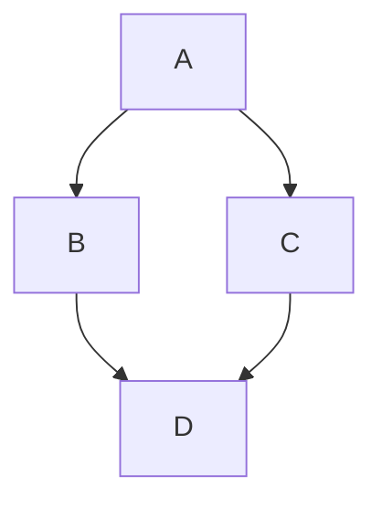
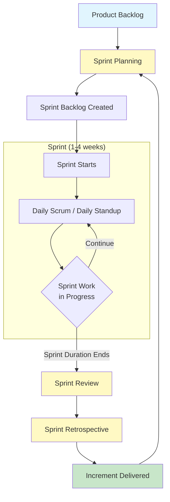
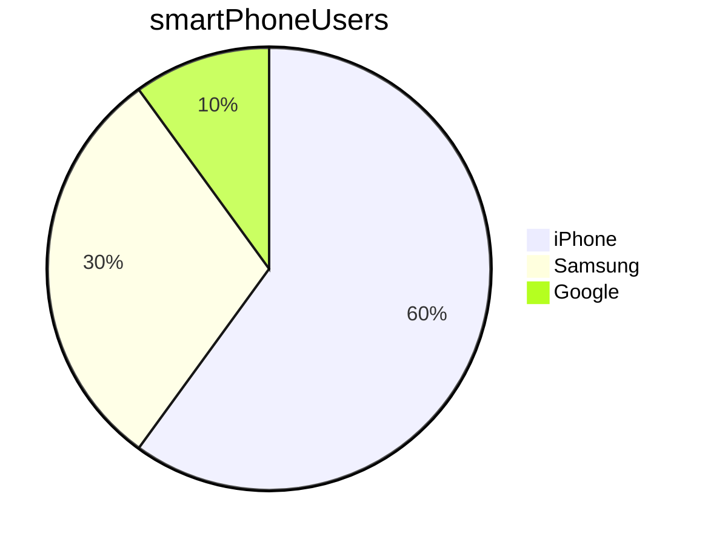

# Header 1
## Header 2

### Header 3

###### Header 6

*This is italics*

_also italics_

**This is bold**

__this is also bold__

__*Bold* but only partly italics__


# Quotes

> The release of GTAVI has been delayed by another 2 years
> > Completed it anyway, mate
> > > Hey Jay


# Lists

- Point 1
- Point 2
- Point 3

* This
* That 
* Other
  * Etc

1. One 
1. Two
1. Three
   1. Three point 1

# Using links

[link is here](https://www.google.com/) click here to go to a webpage

## Pictures

<!-- 

 -->

## Link to document headers

- [Header 1](#header-1)
  - [Header 2](#header-2)
    - [Header 3](#header-3)
          - [Header 6](#header-6)
- [Quotes](#quotes)
- [Lists](#lists)
- [Using links](#using-links)
  - [Pictures](#pictures)
  - [Link to document headers](#link-to-document-headers)
- [GitHub Flavoured Markdown](#github-flavoured-markdown)
- [Tasks Lists](#tasks-lists)
  - [Tables](#tables)
- [Mermaid](#mermaid)

# GitHub Flavoured Markdown

```csharp
public static void Main(){
    Console.WriteLine("Hello, Tech 615");
}
```

```java
public static void main(){
    System.out.Println("Hello, Tech 615");
}
```

```sql
SELECT * FROM Customers
```

# Tasks Lists

- [ ] This is a list item
- [x] This is a list item, too!

## Tables

Name | Street | Town
-----|--------|-----
Nish| Main St| Brum
Cathy| ABC St|Ottawa

# Mermaid





